# Azure VMSS Autoscale

## Project Overview

This project demonstrates how to deploy and configure an Azure Virtual Machine Scale Set (VMSS) with autoscaling based on CPU utilization.

## Azure Services Used

* Azure Virtual Machine Scale Sets
* Azure Virtual Network
* Azure Network Security Group
* Azure Monitor
* Azure Autoscale
* Azure Virtual Machines
* Azure Resource Group

## Autoscaling Configuration

The VM Scale Set is configured with:

* Minimum instances: 2
* Maximum instances: 5
* Default instances: 2
* Scale out when average CPU usage is greater than 70%
* Increase instance count by 1
* Scale in when average CPU usage is less than 30%
* Decrease instance count by 1

## CPU Load Testing

CPU load was generated on the Linux VM using the `stress` utility:

```bash
sudo apt update
sudo apt install -y stress
stress --cpu 2 --timeout 600
```

## Project Screenshots

### 1. Resource Group

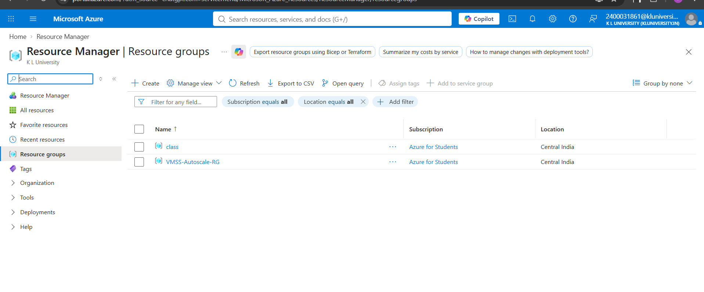

### 2. VMSS Validation

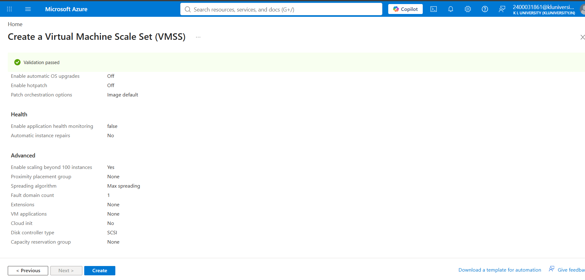

### 3. VMSS Deployment

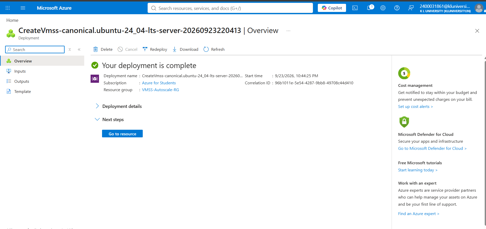

### 4. Initial VMSS Instances

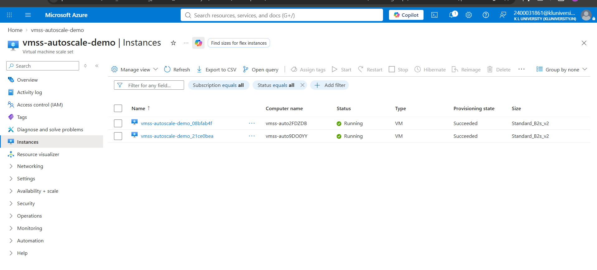

### 5. Autoscale Limits

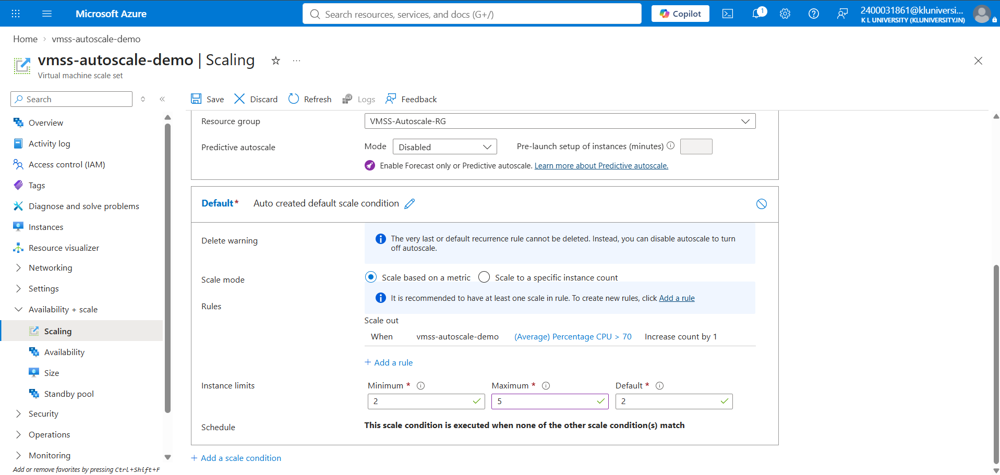

### 6. Autoscale Rules

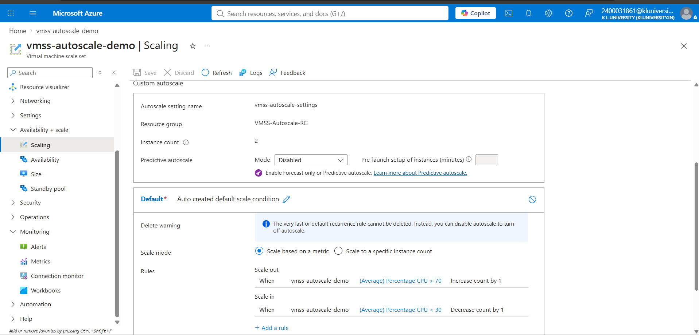

### 7. VMSS Metrics

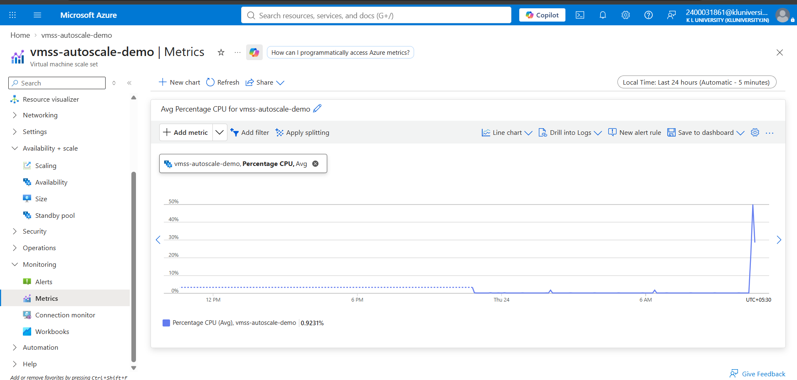

### 8. CPU Metrics

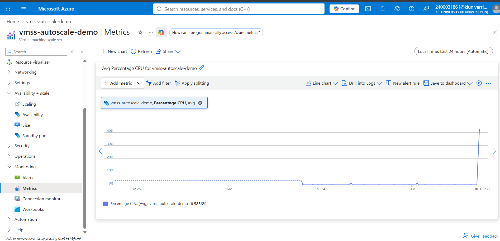

### 9. VMSS Instances

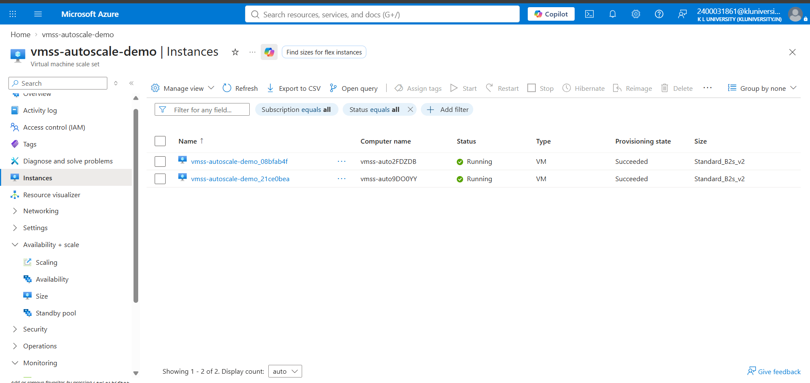

### 10. SSH Inbound Rule

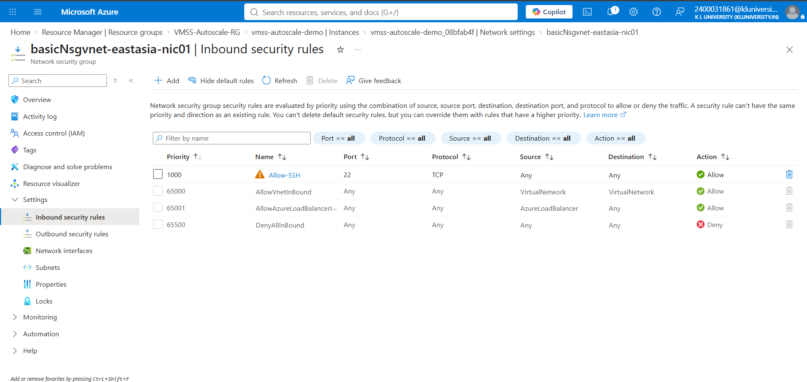

### 11. CPU Load Test

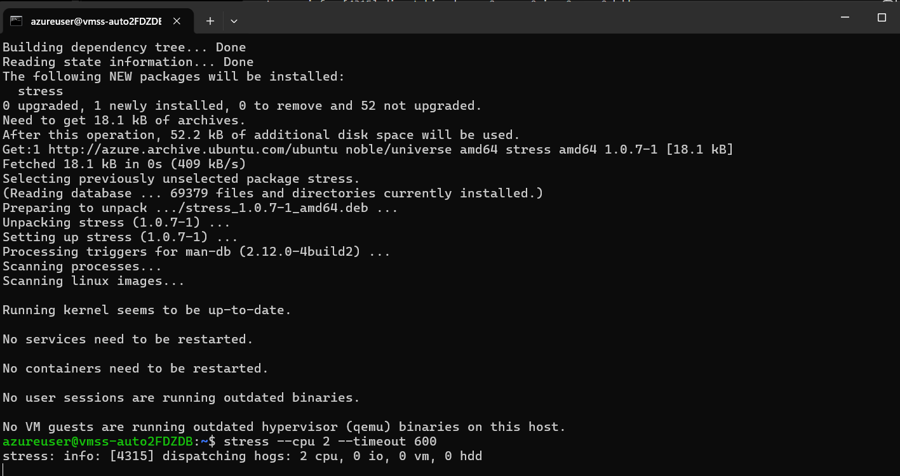

### 12. Final Autoscale Configuration

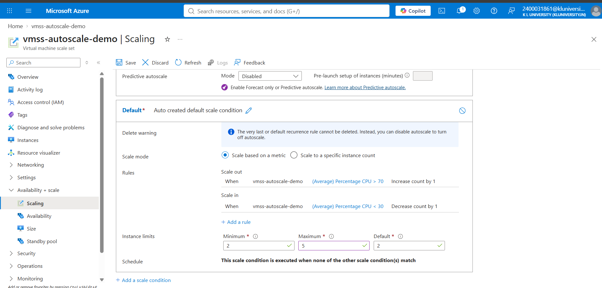

## Result

The Azure VM Scale Set was successfully configured with CPU-based autoscaling. The project demonstrates scaling out when CPU utilization increases and scaling in when CPU utilization decreases.
